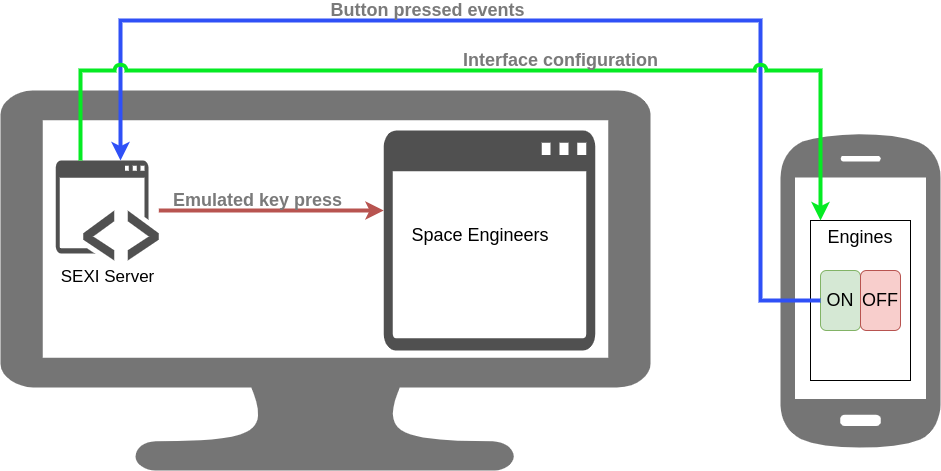

# Space Engineers eXternal Interface (SEXI)

[](http://www.wtfpl.net/txt/copying/)
[](https://travis-ci.org/Jezorko/space-engineers-external-interface)

## Overview

This application allows you to control vehicles in [Space Engineers](https://www.spaceengineersgame.com/) using any
device with a web browser.

It works by running a server in the background that emulates keyboard presses.



## Usage

### Requirements

The application requires JDK >= 1.8 and Maven to build.

Running the JAR requires Java >= 1.8.

### Build & run

To build an executable JAR:

```shell
mvn clean package
```

The JAR will be visible in the `target` directory. It may be run with:

```shell
java -jar target/*-jar-with-dependencies.jar
```

### Templates & interfaces

A layout template defines how the external interface will _look like_, while an interface defines _what actions are
performed_.

When running the application for the first time, an example interface and example template will be created.

### Accessing the interface

First, run the server on the computer running Space Engineers game.

Next, go to `http://ip_address_of_your_computer:3000/index.html` on the device where you wish the interface to be displayed.

From there, choose the interface you wish to use and it will be dynamically generated from the template and interface files.

## Contributions

All PRs are welcome (especially improvements to the frontend, it ain't great).